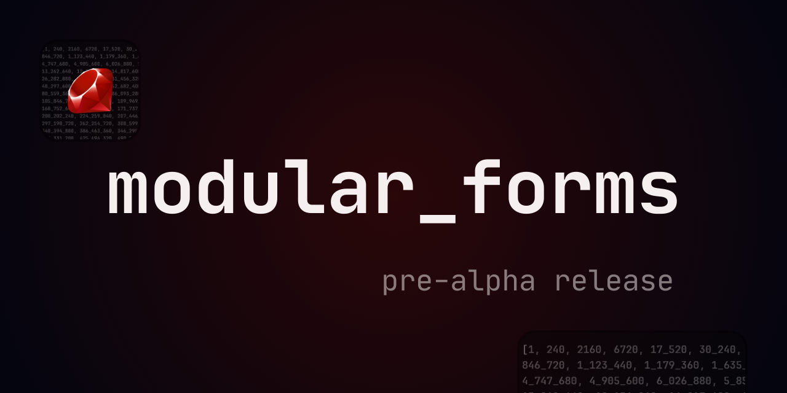

# Modular Forms

A creative toolkit for exploring modular forms and elliptic curves through [Sonic Pi](https://sonic-pi.net/).



## Project Status

This is a pre-alpha release of `modular_forms`. At this stage, only a subset of core mathematical definitions and operations is implemented.
Future updates might include a DSL, depending on how the library is used and the interest from the community. **Contributions** are welcome! Feel free to fork, make changes, and submit a pull request.

## Features

- **Accessible to both musicians and coders**: No math expertise required. Create musical patterns, rhythms, timbres, and harmonies by experimenting with mathematical ideas and turning them into sound and effects intuitively.
- **Interactive Educational Resource**: Use **Sonic Pi** to discover introductory number theory in a hands-on, immersive way, gaining insights into abstract concepts through math in action.

## Purpose and Scope

Given the vastness of the field, this tool intentionally focuses on a limited subset of definitions, without covering all aspects of each. Below is a list of the implemented modules:

- [Eisenstein Series](#eisenstein-series)
- [Eta Functions and Eta Quotients](#eta-functions-and-eta-quotients)
- [Theta functions](#theta-functions)
- [Ramanujan Tau Function](#ramanujan-tau-function)
- [J-Function](#j-function)
- [Hecke Operators](#hecke-operators)
- [SL(2,Z) Group](#sl2z-group)
- [Dirichlet Characters](#dirichlet-characters)
- [Elliptic Curves over Rationals](#elliptic-curves-over-rationals)
- [Elliptic Curves over Finite Fields](#elliptic-curves-over-finite-fields)
- [Newforms Invariants](#newforms-invariants)

### Not Optimized for Computational Efficiency

This library is designed for creative exploration rather than maximum computational efficiency. It is not intended to replace advanced mathematical software. Instead, it draws inspiration from tools like SageMath, Pari/GP, and the LMFDB database.

### Goal
The goal is simple: to provide an accessible and creative starting point for those who wish to explore, learn, and uncover new ideas, regardless of their mathematical background.

## Installation

You can install the `modular_forms` gem directly from **RubyGems** or clone it from GitHub.

```bash
gem install modular_forms
```

## How to use?

You can dive into the beauty of math, both in Ruby and Sonic Pi, creating music in real-time. Here is a simple example of how to use **modular_forms** to generate a basic musical pattern:

```rb
require 'modular_forms'

# Calculate the Eisenstein series of weight k = 4
eisenstein_melody = ModularForms.eisenstein_serie(4)

# Play the melody in a loop with a mathematical transformation
120.times do
  play eisenstein_melody.next % 12 * 7
  sleep 0.5
end
```

## Implemented Modular Forms, Elliptic Curves, and Related Definitions

### Eisenstein Series

1. `ModularForms.eisenstein_series(weight_k, galois_field = nil)`
2. `ModularForms.eisenstein_series_product(weight_k1, weight_k2, prec)`
3. `ModularForms.eisenstein_series_pow(weight_k, power, prec)`

### Eta Functions and Eta Quotients

4. `ModularForms.dedekind_eta_function(m_scale = 1, pentagonal_coefs = false)`
5. `ModularForms.dedekind_eta_pow(power, prec, m_scale = 1)`
6. `ModularForms.dedekind_sum(h, k)`
7. `ModularForms.eta_product(eta1, eta2, prec = nil)`
8.  `ModularForms.eta_quotient(num_eta, den_eta, prec)`

### Theta functions

9. `ModularForms.jacobi_theta_function(jacobi_index = 3, square_coefs = false)`
10.  `ModularForms.jacobi_theta_function_pow(jacobi_index, power, prec)`

### Ramanujan Tau Function

11. `ModularForms.ramanujan_tau_function`

### J-Function

12. `ModularForms.j_function(prec)`

### Hecke Operators

13. `ModularForms.hecke_operator_prime_non_cusp(non_cusp_form_arr, prime, weight_k, prec)`
14. `ModularForms.hecke_operator_prime_cusp(cusp_form_arr, prime, weight_k, prec)`

### SL(2,Z) Group

15. `ModularForms.t_gen_matrix(n_power)`
16. `ModularForms.s_gen_matrix(n_power)`
17. `ModularForms.u_gen_matrix(mod_n)`
18. `ModularForms.st_gen_matrix(n_power)`
19. `ModularForms.product_gen_mats(gen_mat_a, gen_mat_b)`
20. `ModularForms.gamma0_index(n)`
21. `ModularForms.gamma1_index(n)`

### Dirichlet Characters

22. `ModularForms.dirichlet_trivchar(modq, a)`
23. `ModularForms.conrey_p_pminus1(modp, a)`
24. `ModularForms.gauss_sum_triv(dirichlet_q, a)`
25. `ModularForms.gauss_sum_conrey_p_minus1(dirichlet_q, a, parity)`

### Elliptic Curves over Rationals

26. `ModularForms.elliptic_curve_q(coefs)`
27. `ModularForms.discriminant_q(curve)`
28. `ModularForms.j_invariant_q(curve)`
29. `ModularForms.point_on_curve_q?(curve, point)`
30. `ModularForms.point_addition_q(curve, p, q)`
31. `ModularForms.scalar_mul_point_q(curve, n, point)`
32. `ModularForms.isogeny_2deg_q(curve, point_2tor)`
33. `ModularForms.isogeny_ndeg_q(curve, point_ntor, order)`
34. `ModularForms.weil_height(x_point)`
35. `ModularForms.canonical_height(curve, point, prec = 64)`

### Elliptic Curves over Finite Fields

36. `ModularForms.elliptic_curve_fp(p, coefs)`
37. `ModularForms.point_on_curve_modp?(curve, point)`
38. `ModularForms.discriminant_modp(curve)`
39. `ModularForms.j_invariant_modp(curve)`
40. `ModularForms.point_addition_modp(curve, p_point, q_point)`
41. `ModularForms.scalar_mul_point_modp(curve, n, point)`
42. `ModularForms.points_fp(curve, point_at_infinity = false)`
43. `ModularForms.cardinality_fp(curve)`
44. `ModularForms.quadratic_twist_fp(curve)`

### Newforms Invariants
45. `ModularForms.analytic_conductor(level_n, weight_k)`

