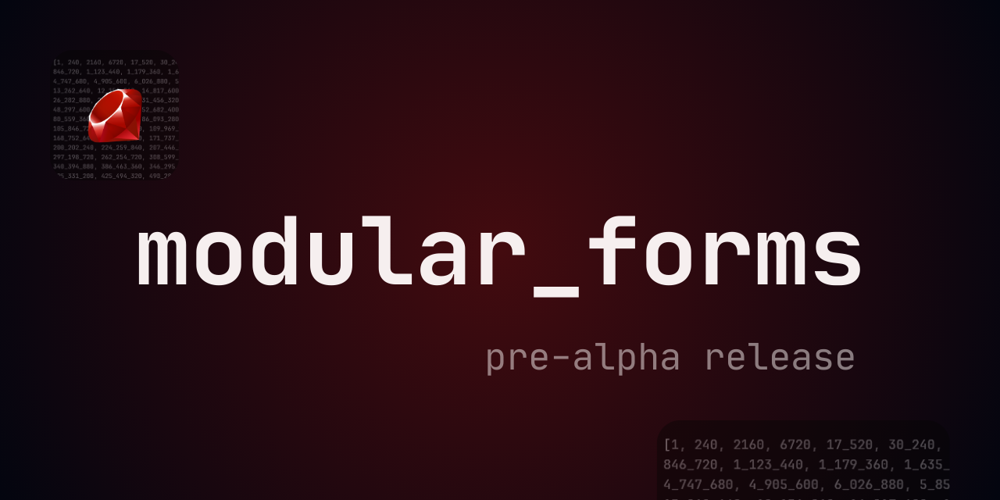

# Modular forms

Explore a primer on the mathematical symmetries of `Modular Forms` through algorithmic composition and live coding with [Sonic Pi](https://sonic-pi.net/).



## Features

- **Accessibility for musicians and coders**: No need for a heavy mathematical background—explore the beauty of modular forms through music.
- **Interactive Educational Tool**: Use **Sonic Pi** to teach number theory concepts in a hands-on, immersive way. Allow students to experiment with live coding and experience the interplay between mathematical concepts and sound creation.
- **Mathematical Sound Design**: Generate musical patterns, rhythms, timbres, and harmonies based on modular forms,  seamlessly blending mathematics and music through algorithmic manipulation.

## Purpose and Scope

This project provides an engaging exploration of modular forms, designed for musicians, developers, and educators interested in the connection between mathematics and music. Given the vastness of the field, we intentionally focused on a limited subset of concepts, such as Eisenstein series or Dedekind functions, which are often studied at an introductory level.
[See the full list below.](#implemented-modular-forms-generators-and-operations)

- **Not optimized for high performance**: This library is not intended to guarantee maximum efficiency or to serve as a replacement for advanced mathematical software specialized in modular form computations.
- **Normalized modular functions**: Several of these modular functions are normalized, ensuring consistent and standard q-expansions for musical applications.

The goal is to offer an approachable entry point for those without a deep mathematical background, while maintaining rigor in the use of the functions. However, this does not exclude the possibility of discovering interesting mathematical insights through **playful experimentation**. You may uncover **new ideas** and patterns that seamlessly blend the beauty of mathematics with musical creativity.

## Installation

You can install the `modular_forms` gem directly from **RubyGems** or clone it from GitHub.

```bash
gem install modular_forms
```

## How to use?

You can dive into the beauty of math, both in Ruby and Sonic Pi, creating music in real-time.  Here’s a simple example of how to use **modular_forms** to generate a basic musical pattern:

```rb
require 'modular_forms'

# Calculate the Eisenstein series of weight k = 4
eisenstein_melody = ModularForms.eisenstein_serie(4)

# Play the melody in a loop with a mathematical transformation
120.times do
  play eisenstein_melody.next % 12 * 7
  sleep 0.5
end
```

## Implemented Modular Forms Generators and Operations

<!-- Normalized -->
1. `ModularForms.eisenstein_serie(weight_k, galois_field = nil)`
2. `ModularForms.eisenstein_series_product(weight_k1, weight_k2, precision)`
3. `ModularForms.eisenstein_serie_power(weight_k, power, precision)`
4. `ModularForms.dedekind_eta_function(pentagonal_coefs = false)`
5. `ModularForms.dedekind_eta_power(power, precision)`
6. `ModularForms.ramanujan_tau_function`
7. `ModularForms.jacobi_theta_function(jacobi_index = 3, square_coefs = false)`
8. `ModularForms.jacobi_theta_power(jacobi_index, power, precision)`
9. `ModularForms.j_invariant(precision)`
